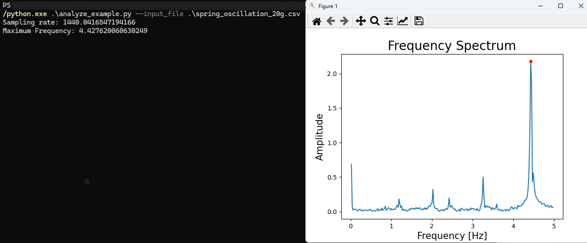

# Digital Physics Laboratory Project Manual

## 1. Introduction
The Digital Physics Laboratory Project leverages millimeter-wave radar technology to enable precise, non-contact motion measurement for physics experiments. This manual serves as a comprehensive guide to understanding, replicating, and utilizing the system effectively, with a focus on making it accessible for educators and students.
This project is tailored to empower educators in creating engaging, hands-on experiences for students, bridging theoretical concepts with practical applications. Whether you are a teacher introducing basic mechanics or an advanced student exploring signal processing, this system provides a versatile platform to enhance learning.

## 2. System Overview

### Core Components

1. **Millimeter-Wave Radar**:
    - **Model**: RFbeam Microwave GmbH K-LC7
    - **Operating Frequency**: $f_t = 24GHz$
    - **Function**: Captures motion data and outputs analog signals, which are processed to derive velocity and displacement.
    - **Key Features**:
        - Compact design for easy integration.
        - High sensitivity for small motion detection.
    - **Applications**: Non-contact motion tracking, vibration analysis, and frequency measurement.


2. **Signal Conditioning Circuit**:
    - **Purpose**: Amplifies and filters radar output signals to ensure compatibility with the ADC in the ESP32 microcontroller.
    - **Design**:
        - Low-noise amplifier (LNA) using OPA4340 for signal amplification.
        - Band-pass filter to isolate desired frequency ranges.
    - **Software Tools**:
        - Designed using KiCad for schematics and PCB layout.
    - **Physical Details**:
        - Total PCB size: $\approx 500mm^2$
        - Compact design allows easy integration into enclosures.
    - **Applications**:
        - Noise reduction in signal acquisition.
        - Improved ADC accuracy and signal stability.


3. **ESP32 Microcontroller**:
    - **Purpose**: Converts conditioned analog signals to digital data and transmits them to a computer via a serial port for analysis.
    - **Key Features**:
        - 12-bit ADC resolution for high-accuracy digitization.
        - Real-time data processing capabilities.
    - **Software Support**:
        - Programmed using Arduino IDE for easy development and deployment.
    - **Connections**:
        - Analog input: Receives conditioned signals from the radar.
        - Serial output: Sends digital data to a connected PC or device.
    - **Applications**:
        - Real-time motion analysis.

4. **Python-Based Software**:
    - **Purpose**: Processes and visualizes the collected data from the ESP32.
    - **Key Features**:
        - **Signal Processing**:
            - High-pass filtering to remove low-frequency noise.
            - FFT (Fast Fourier Transform) for frequency domain analysis.
        - **Visualization**:
            - Time-domain plots for raw and filtered signals.
            - Frequency spectrum analysis for identifying dominant frequencies.
        - **Customization**:
            - Open-source Python scripts allow users to modify and expand functionality.
    - **User Interface**:
        - Provides a command-line interface (CLI) for loading and analyzing data.
        - Optional GUI for real-time visualization (developed using Tkinter).
    - **Applications**:
        - Understanding harmonic motion and resonance.

## 3. Hardware Guide

### Schematics
- The schematic (`design_project.pdf`) provides a detailed blueprint of the system. It includes:
  1. **Radar Module**: Interfaces with the 24 GHz radar.
  2. **Amplification Stage**: Features OPA4340 for low-noise signal conditioning.
  3. **Microcontroller Connections**: Configures ADC inputs and communication lines.
  4. **Power Management**: Converts 5V to 3.3V using AMS1117.

### PCB Design
- **Gerber Files**: Located in the `hardware/PCB/` folder, ready for PCB fabrication.
- **3D Model**: Available in `hardware/3D_model/` for visualization and enclosure design.
- **Assembly Notes**:
  1. Solder components carefully to avoid thermal damage.
  2. Use decoupling capacitors to stabilize power supply lines.


## 4. Firmware Guide

### Overview
The firmware is designed for the ESP32 microcontroller and performs:
1. **ADC Sampling**: Converts analog radar signals to digital data.
2. **Data Transmission**: Sends data wirelessly for analysis.

### File Structure
- `adc_sampling.cpp`: Initializes and manages ADC sampling.
- `esp32_config.cpp`: Sets up ESP32 peripherals.
- `main.ino`: Main entry point for the program.

### Deployment
1. Open the firmware folder in Arduino IDE.
2. Connect the ESP32 to your computer.
3. Select the appropriate board and port.
4. Upload the code to the ESP32.

---

## 5. Software Guide

### Python-Based Analysis
- The software is located in the `software/` folder.
- Required dependencies are listed in `requirements.txt`.
- Key scripts:
  1. `gui.py`: Provides a graphical interface for real-time analysis.
  2. `data_collector.py`: Handles data acquisition and preprocessing.

### Running the Software
1. Install dependencies:
   ```bash
   pip install -r requirements.txt
   ```
2. Execute the analysis script:
   ```bash
   python gui.py
   ```

---

## 6. Examples and Usage

### Example Data
- Sample datasets are provided in the `examples/` folder:
  - `spring_oscillation_20g.csv`: Data for 20g mass.
  - `spring_oscillation_40g.csv`: Data for 40g mass.

### Visualization
- Run the example analysis script:
  ```bash
  python analyze_example.py --input_file spring_oscillation_20g.csv
  ```
- Output includes:
  1. Frequency spectrum visualization.
  2. Filtered motion data.

### Teacher Notes
- Encourage students to hypothesize the effects of varying mass on oscillation frequency.
- Demonstrate how data filtering improves signal clarity and measurement accuracy.
- Use provided Python scripts as a stepping stone for students to develop their own data analysis tools.

---

## 7. Educational Applications

### Enhancing Physics Labs
This system introduces students to cutting-edge measurement techniques, bridging traditional physics experiments with modern technology:
- **Harmonic Motion Experiments**:
  - Measure oscillation frequencies of different masses.
  - Analyze how the spring constant and damping factors affect motion.
- **Waveform Analysis**:
  - Teach students about filtering and noise reduction.
  - Visualize motion data in real-time.

### Data Literacy
- **Data Collection**:
  - Show students how to collect accurate, repeatable measurements using radar and microcontrollers.
- **Data Analysis**:
  - Use Python scripts to process data, introducing students to concepts like FFT (Fast Fourier Transform) and time-domain analysis.

### Cross-Disciplinary Applications
This system provides opportunities for collaboration between physics, electronics, and computer science courses:
- **Physics**: Understanding motion and forces.
- **Electronics**: Building and testing circuits.
- **Programming**: Writing and modifying analysis scripts.

### Accessibility
- Open-source design ensures that schools with limited budgets can implement advanced measurement systems at a fraction of the cost of commercial solutions.
- Modular design allows educators to adapt the system for various experiments, from pendulum studies to resonance analysis.

### Inspiring Creativity
- Encourage students to explore beyond harmonic motion by experimenting with non-linear systems, compound pendulums, or even chaotic oscillators.
- Allow students to modify the firmware or analysis scripts to fit specific experimental needs.

---

## 8. Appendix

### Bill of Materials (BOM)
Refer to `hardware/bill_of_materials.csv` for a complete list of components, including:
- Resistors, capacitors, and ICs.
- Radar module and ESP32 board.

### FAQ
**Q**: What should I do if the radar output is noisy?
**A**: Ensure proper grounding and use shielded cables.

**Q**: How can I modify the filter parameters?
**A**: Edit the cutoff frequency and order in the firmware.

**Q**: Can this system be used for other types of motion analysis?
**A**: Yes, the modular design allows for various applications, including pendulums, resonance experiments, and fluid dynamics visualization.


### Example Output

- Frequency spectrum of 20g mass oscillation.


